# FreelanceWeb - Eduardo Romero

Sitio web personal de portafolio freelance con chatbot con IA, formulario de contacto funcional y enlace a WhatsApp.

## Stack

- HTML, CSS, JavaScript (vanilla)
- Netlify (hosting + serverless functions)
- Resend (envío de correos)

## Estructura

```
freelanceWeb/
├── index.html                 # Página principal
├── sobre-mi.html              # Página sobre mí
├── css/
│   ├── normalize.css
│   ├── styles.css             # Estilos generales, modo oscuro, testimonios
│   └── chatbot.css            # Estilos del chatbot
├── js/
│   ├── main.js                # Formulario y toggle modo oscuro
│   └── chatbot.js             # Chatbot frontend
├── img/
│   ├── chatbotIcon.png
│   ├── nerd.png               # Favicon
│   └── hero.jpg
├── netlify/
│   └── functions/
│       ├── send-email.js      # Serverless: envío de correos (Resend)
│       └── chatbot.js         # Serverless: matching semántico del chatbot
├── knowledge.json             # Base de conocimiento del chatbot
├── netlify.toml               # Configuración de Netlify
├── package.json
└── .env.example               # Template de variables de entorno
```

## Variables de entorno

Configurar en **Netlify Dashboard → Site settings → Environment variables**:

| Variable | Descripción |
|----------|-------------|
| `RESEND_API_KEY` | API key de [Resend](https://resend.com) |
| `CONTACT_EMAIL` | Correo destino donde se reciben los mensajes |

## Desarrollo local

```bash
npm install
netlify dev
```

## Despliegue

```bash
git push origin master
```

Netlify despliega automáticamente al detectar el push.

## Funcionalidades

- **Chatbot con IA** — Botón flotante que abre una ventana de chat con matching semántico TF-IDF sobre `knowledge.json`. Responde preguntas sobre experiencia, proyectos, habilidades y más. Historial persistente por sesión e indicador de escritura.
- **Formulario de contacto** — Validación frontend + envío serverless vía Resend con feedback visual de éxito/error.
- **Botón flotante de WhatsApp** — Enlace directo en esquina inferior derecha.
- **Modo oscuro** — Toggle global con persistencia en localStorage y adaptación completa de todos los componentes.
- **Sección de testimonios** — Cards con reseñas de clientes en la página principal.
- **Página Sobre Mí** — Perfil profesional, badges de habilidades, experiencia destacada con cards interactivas y certificaciones con enlaces verificables.
- **Diseño responsive** — Adaptable a móvil, tablet y escritorio.
- **SEO básico** — Meta viewport, fuentes con preload, títulos descriptivos y favicon.

## Arquitectura del Chatbot



## Licencia

© 2025 Eduardo Romero - Freelancer Web Dev
